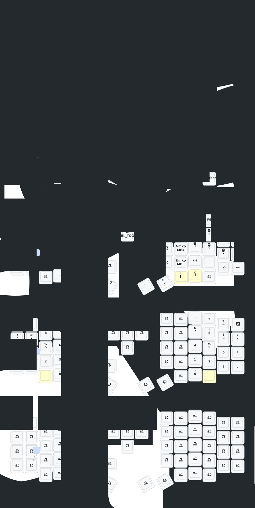

# Sofle

- [中文](README.md)
- [English](README_EN.md)

## 更新列表

- 2024/12/21
  1. 增加zmk-studio支持（只需要刷新左手即可使用）。
- 2024/10/24
  1. 修改供电模式，功耗降低。
  2. 修正RGB供电自动关闭的功能。
- 2025/3/30 增加睡眠进入时间1小时  增加防抖时间 优化睡眠后功耗 
- 2025/8/22
  1. 更新了soft off。当您同时按下 Q、S 和 Z 键并按住 2 秒钟时，键盘将进入深度睡眠状态，无法通过按键唤醒。携带外出时可以使用此功能。激活方式为按一次复位开关。
  2. 这个月，我还更新了矮轴版本sofle和corne的外壳。框架和底板加厚了，复位开关的开口也进行了调整，可以轻松按下复位开关。目前，我们仍在构思如何设计带有倾斜支架的外壳。如果您仔细检查过 PCB，您会注意到有用于扩展 IO 的预留接口。不知道有没有人能够使用它们，我会尝试一下！
  3. 右侧键盘屏幕上的GIF动画被移除，这将显著降低右侧键盘的功耗。

> 如果您的键盘于2025年8月22之前更新，请更新最新的固件。
>

## 联系我

如需3D打印的模型文件或者键盘有任何异常和故障，请联系380465425@qq.com

## Sofle键位图

